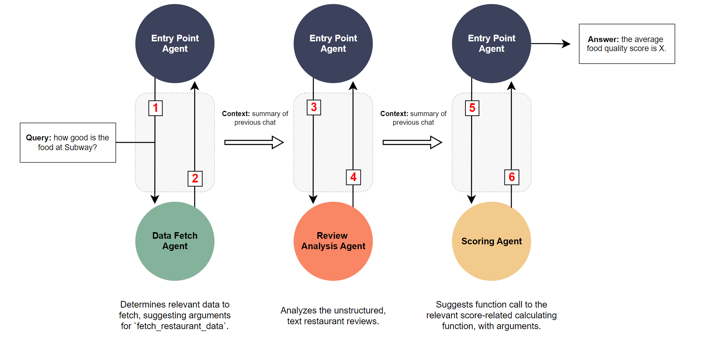

# Restaurant Reviewer Agents

This project demnstrates the use of AutoGen to create agents that can fetch,analyze and score restaurant reviews.

This project was done as a part of Berkeley's [LLM MOOC](https://llmagents-learning.org/f24
)

The project follows the given conversation pattern

The code files are as follows
- `main.py`: the main file that contains the code for the entry point agent
- `test.py`: the test file that contains the test cases for the entry point agent

To run the project simply run `main.py` with the query as a command line argument. 
For example: `python main.py "What is the overall score for taco bell?"`

